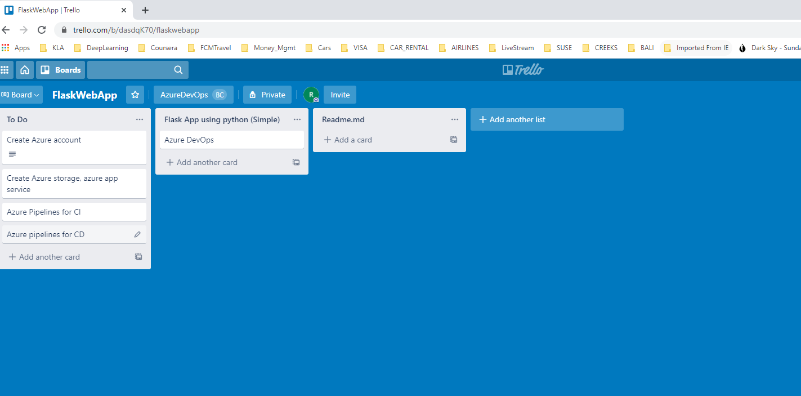
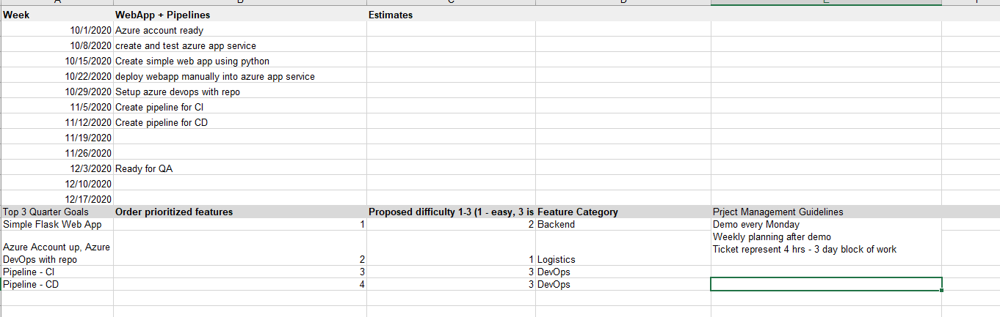
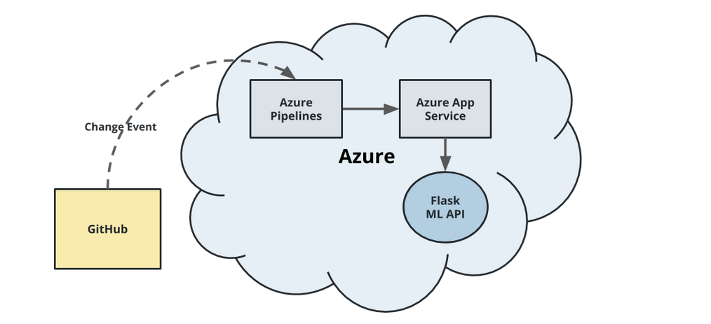
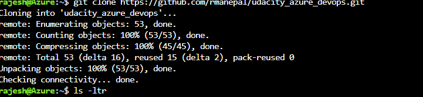
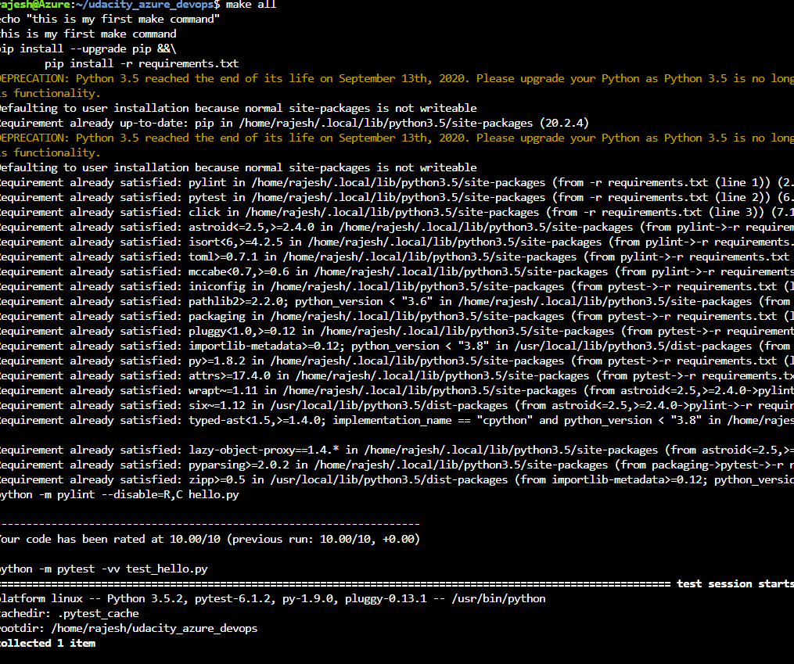
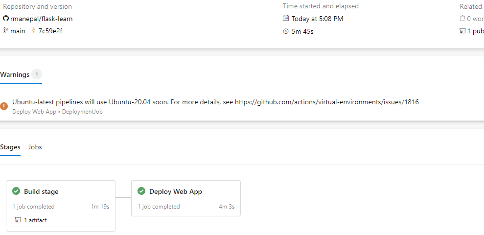
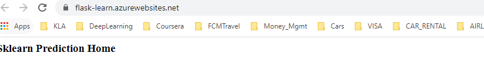
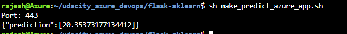
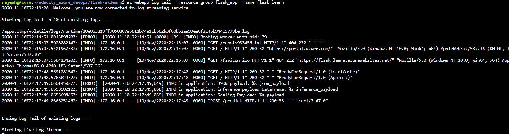
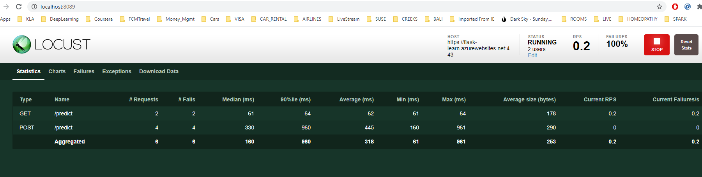

[](https://github.com/AndreSand/BornInApp/actions)


# Overview

Project - Flask web app which can predict housing prices for given inputs.
		  Exposes a REST API in the backend, front end with HTML with all required input values.
		  Code is int git hub
		  Pipeline - Azure pipelines 
		  Deployment - Azure Cloud app service 

## Project Plan
https://trello.com/b/dasdqK70/flaskwebapp



find the project planning spreadsheet here
./resources/project-management-tempalte.xlsx 




## Instructions


* Architectural Diagram (Shows how key parts of the system work)>

Instructions to run:
1. Clone this repo into azure cli 
2. run command 'make all' 

Launch azure portal, clone git repo using: git clone https://github.com/rmanepal/udacity_azure_devops.git



Compile project and run tests.

1. `make all` will compile and build the project
2. `make test` shall run unit tests and ensure all tests are passed




Pipeline 
Any changes to the projectin github, shal trigger pipeline automatically
 - compile (liniting)
 - build
 - deploy

(https://docs.microsoft.com/en-us/azure/devops/pipelines/ecosystems/python-webapp?view=azure-devops).

Launch website:

* Running Azure App Service from Azure Pipelines automatic deployment

Run make_predict_azure_app.sh 


* Successful prediction from deployed flask app in Azure Cloud Shell.  [Use this file as a template for the deployed prediction](https://github.com/udacity/nd082-Azure-Cloud-DevOps-Starter-Code/blob/master/C2-AgileDevelopmentwithAzure/project/starter_files/flask-sklearn/make_predict_azure_app.sh).
The output should look similar to this:

```bash
udacity@Azure:~$ ./make_predict_azure_app.sh
Port: 443
{"prediction":[20.35373177134412]}
```


Able to stream logs

> 

Load tests using locust



## Enhancements

1. Project needs to be enhanced with HTML page as front end
2. Accepts inputs from user and call webapp at backend
3. predict the results

## Demo 

https://youtu.be/M75FS4Tjn8I

